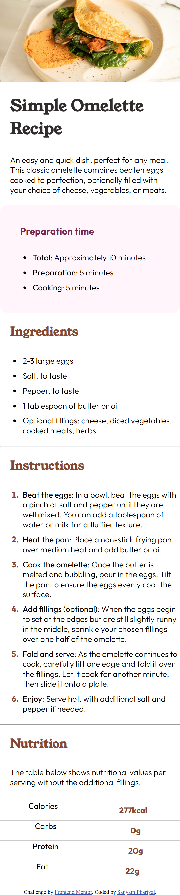
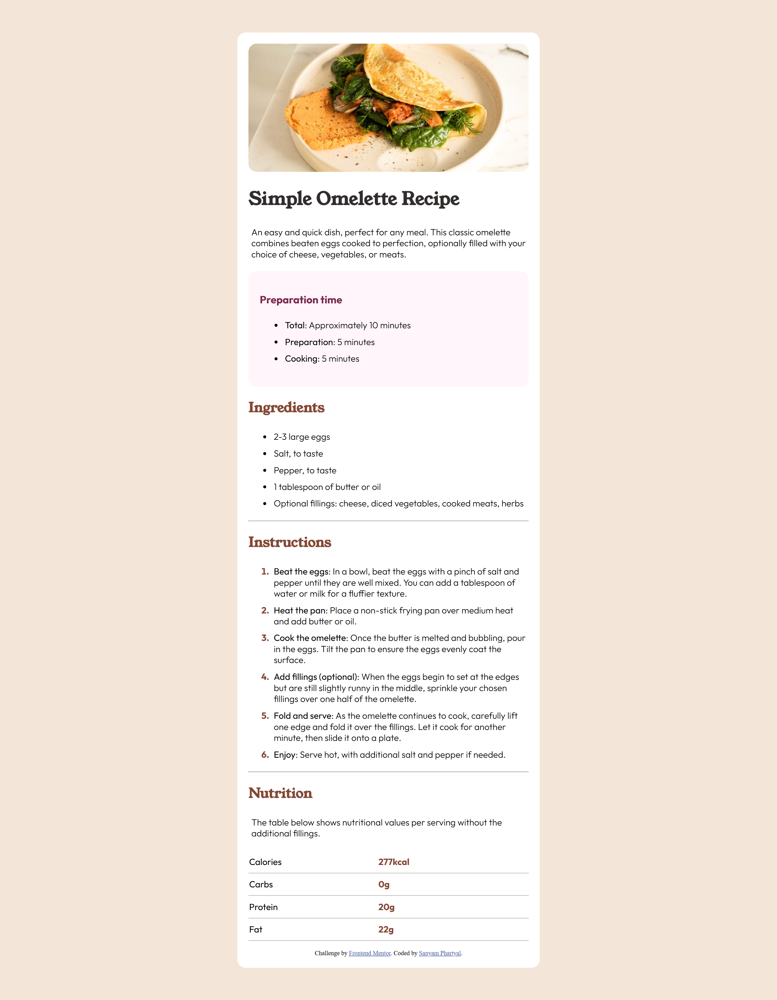

# Frontend Mentor - Recipe page solution

This is my solution to the [Recipe page challenge on Frontend Mentor](https://www.frontendmentor.io/challenges/recipe-page-KiTsR8QQKm). This challenge helped me improve my HTML and CSS skills by focusing on layout, typography, and accessibility.

## Table of contents

- [Overview](#overview)
  - [Screenshot](#screenshot)
  - [Links](#links)
- [My process](#my-process)
  - [Built with](#built-with)
  - [What I learned](#what-i-learned)
- [Author](#author)

## Overview

### Screenshot

### Links

- Solution URL: [Frontend Mentor](https://www.frontendmentor.io/solutions/responsive-landing-page-using-html-and-css-tLlbfj9W_x)
- Live Site URL: [Live Demo]( https://sanyam2511.github.io/frontend-mentor-recipe-page/)

## My process

### Built with

- Semantic HTML5
- CSS Flexbox
- Mobile-first design

### What I learned

While building this project, I learned how to:
- Write clean and accessible HTML
- Apply consistent spacing and typography with CSS
- Create responsive layouts with Flexbox

Example snippet:

 
<h3>Preparation time</h3>
    <ul>
  <li><b>Total</b>: Approximately 10 minutes</li>
  <li><b>Preparation</b>: 5 minutes</li>
  <li><b>Cooking</b>: 5 minutes</li>
   </ul>
  

## Author

- Website - [Add your name here](https://sanyam2511.github.io/portfolio/)
- Frontend Mentor - [@yourusername](https://www.frontendmentor.io/profile/yourusername)
- Twitter - [@yourusername](https://www.twitter.com/yourusername)

**Note: Delete this note and add/remove/edit lines above based on what links you'd like to share.**

## Acknowledgments

This is where you can give a hat tip to anyone who helped you out on this project. Perhaps you worked in a team or got some inspiration from someone else's solution. This is the perfect place to give them some credit.

**Note: Delete this note and edit this section's content as necessary. If you completed this challenge by yourself, feel free to delete this section entirely.**
